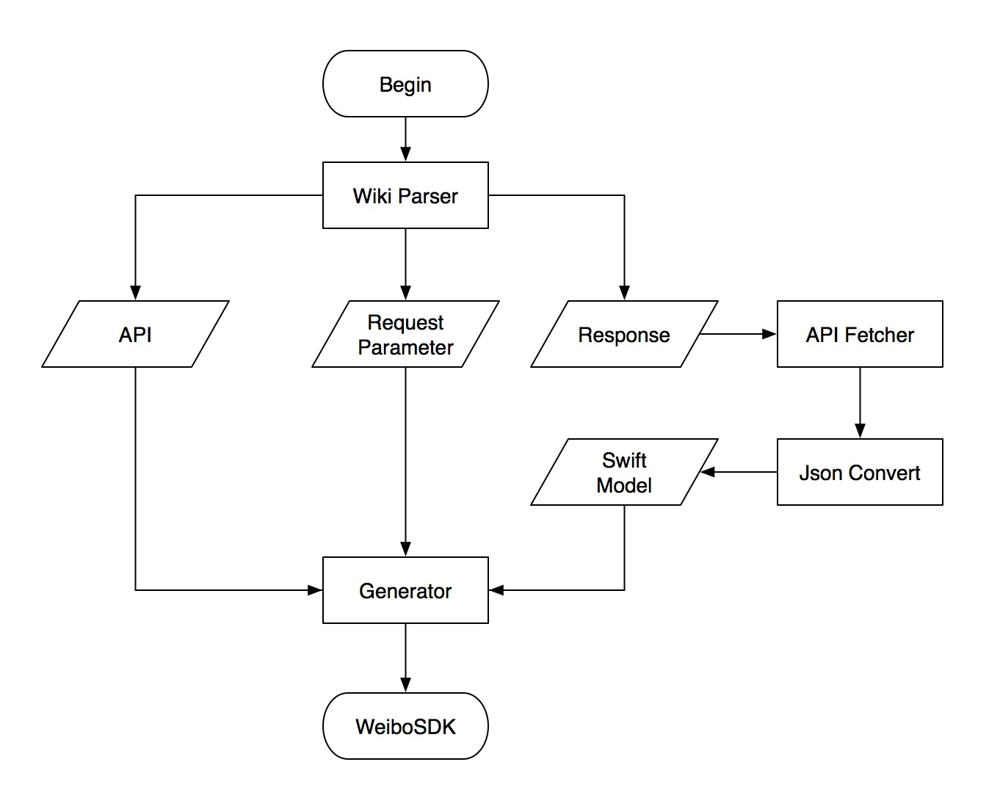

# NOTE!!!

Since [Weibo Open API](http://open.weibo.com/wiki/%E5%BE%AE%E5%8D%9AAPI) does not provide post Weibo anymore. You should prefer to use [official weibosdk](https://github.com/sinaweibosdk/weibo_ios_sdk) .

# WeiboSDKGenerator
Weibo iOS SDK Generator

# Requirements

* Swift 4.0+
* Xcode 9.2+

# Installation

This project just demonstrate how can we generate Weibo SDK via API wiki.

# How it works

1. parse [Weibo wiki](http://open.weibo.com/wiki/%E5%BE%AE%E5%8D%9AAPI) int API JSON file

2. fetch API response and generate API response model

3. create Weibo SDK based on [GenericNetworking](https://github.com/alexiscn/GenericNetworking) 

 

# Contents in Directory

* **WikiParser.py**
  * a python script collection api json files from wiki
* **WeiboSDK**
  * Pod Classes files
* **SampleProject**
  * a sample project shows how to use WeiboSDK
* **WBSDKGenerator**
  * a Mac terminal app to generate WeiboSDK according jsons files created by WikiParser.py
  
